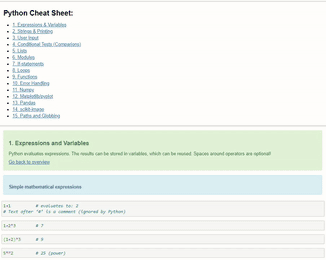
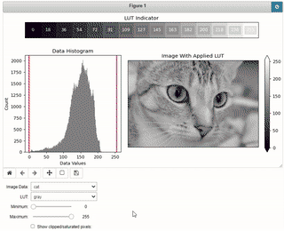
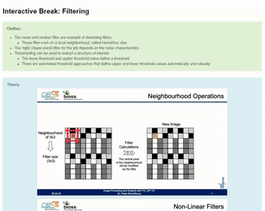
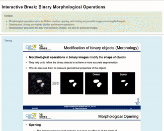
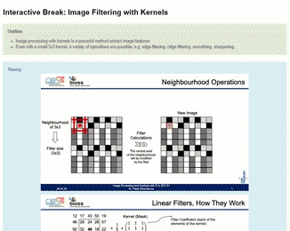
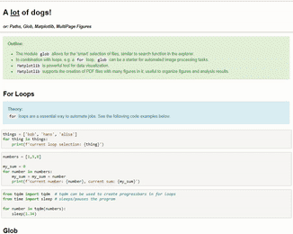
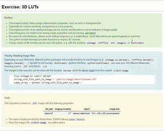

This repository is a living collection of my resources to introduce/teach python and image analysis.

The [Python Cheat Sheet](#python-cheat-sheet-), especially the Jupyter variant, is meant to be extended by the learner. [Interactive Breaks](#interactive-breaks-) are thought to explain/deepen concepts via widgets, often with a fun twist (or cute animals). [Exercises](#exercises-)  will require some kind of coding. [WarmUps](#warmups-) are exercises that try to reduce frustration, especially for coding beginners.
    
If these things are helpful for you, please use them! Contributions, comments, mails, dm's etc. are very welcome. Let me know if these things help you :-)

If you use the Binders a lot, please consider [donating](https://numfocus.salsalabs.org/donate-to-binder/index.html) to them, they're amazing.
  
Cheers,

Joe

---

## 🏠 Table of Contents

* [Notebook Previews/Binder Links](#notebook-previewsbinder-links-)
    * [Whole Repo](#whole-repo-)
    * [Python Cheat Sheet](#python-cheat-sheet-)
    * [Interactive Breaks](#interactive-breaks-)
        * [Break – LUTs/Colormaps](#break--lutscolormaps-)
        * [Break – Mean/Median/Thresholding](#break--meanmedianthresholding-)
        * [Break - Dilation/Erosion/Opening/Closing](#break--dilationerosionopeningclosing-)
        * [Break - Image Processing with Filter Kernels](#break--image-processing-with-filter-kernels-)
    * [Exercises](#exercises-) 
    * [WarmUps](#warmups-)
* [Especially Recommended Further Resources](#especially-recommended-further-resources-)

  
  
---
### Notebook Previews/Binder Links [🏠](#-table-of-contents)

#### Whole Repo [🏠](#-table-of-contents)

---

#### Python Cheat Sheet [🏠](#-table-of-contents)

  [PDF](https://docs.google.com/viewer?url=https://raw.githubusercontent.com/JoeGreiner/FiltersAndMorphologicalOpsDemo/main/Python_CheatSheet/python_cheat_sheet.pdf)

---

### Interactive Breaks [🏠](#-table-of-contents)
#### Break – LUTs/Colormaps [🏠](#-table-of-contents)

---

#### Break – Mean/Median/Thresholding [🏠](#-table-of-contents)

---

#### Break – Dilation/Erosion/Opening/Closing [🏠](#-table-of-contents)

---

#### Break – Image Processing with Filter Kernels [🏠](#-table-of-contents)

---

### Exercises [🏠](#-table-of-contents)
Exercise - A Lot of Dogs [🏠](#-table-of-contents)

---

Exercise - Time Series Analysis [🏠](#-table-of-contents)

---

Exercise - 3D LUT [🏠](#-table-of-contents)

---

Exercise - Arrays [🏠](#-table-of-contents)

---

Exercise - Install Modules & Matplotlib [🏠](#-table-of-contents)

---

### WarmUps [🏠](#-table-of-contents)
WarmUp – Paths & Syntax [🏠](#-table-of-contents)

---

## Especially Recommended Further Resources [🏠](#-table-of-contents)
* Of course, this list is highly subjective, and by no means complete or exhaustive.

### General [🏠](#-table-of-contents)
* [Pete Bankhead's "Introduction to Bioimage Analysis"](https://bioimagebook.github.io/README.html)
* [Pete Bankhead's "Introduction to Bioimage Analysis"](https://bioimagebook.github.io/README.html) (I know it's duplicated, but it is <b>that</b> good!)
* [A Hitchhiker`s Guide through the Bio-image Analysis Software Universe](https://arxiv.org/abs/2204.07547?context=eess)
* [image.sc Forum](https://forum.image.sc/)
* [biii.eu - List of Image Analysis Tools](https://biii.eu/)
* [NEUBIAS Academy @ Home](http://eubias.org/NEUBIAS/training-schools/neubias-academy-home/)
* [Robert Haase's Youtube](https://www.youtube.com/channel/UC-hlwQ9Q4GS3rtv2EwSStAQ)

### More Specific [🏠](#-table-of-contents)
* [ImageJ/FiJi Wiki](https://imagej.net/tutorials/)
* [Ilastik](https://www.ilastik.org/documentation/index.html)
* [Napari](https://napari.org/)
* [QuPath](https://qupath.readthedocs.io/en/stable/)
* [Icy](https://icy.bioimageanalysis.org/)
* [scikit-image's Tutorial Gallery](https://scikit-image.org/docs/stable/auto_examples/index.html)
* [cellpose](https://cellpose.readthedocs.io/en/latest/)
* [CellProfiler](https://cellprofiler.org/)
* [KNIME](https://www.knime.com/)
* [3D Slicer](https://www.slicer.org/)
* [VesselVio - Vasculature Toolkit](https://jacobbumgarner.github.io/VesselVio/)
* [ITK Snap](http://www.itksnap.org/pmwiki/pmwiki.php)

### Advanced Tools, But Great Tools! [🏠](#-table-of-contents)
* [ITK](https://itk.org/)
* [VTK](https://vtk.org/)
* [ParaView](https://www.paraview.org/)
* [Blender](https://www.blender.org/)
